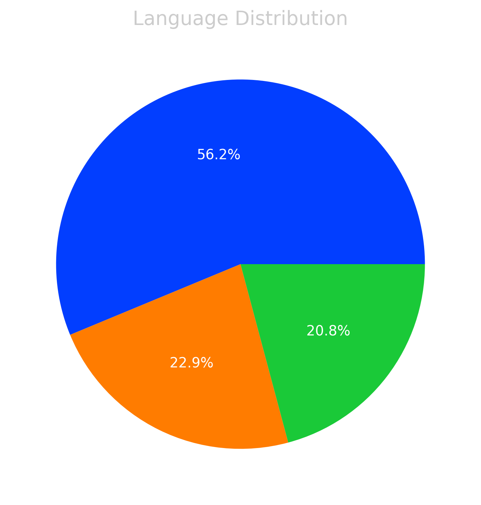
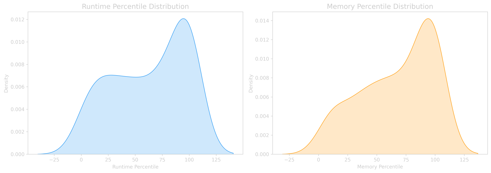

# LeetCode Progress Dashboard 📊

## Recent Solutions
### get-the-size-of-a-dataframe-3076
- **Runtime:** `589.00ms` (Top 24.98%)
- **Memory:** `65.50MB` (Top 76.23%)

### drop-missing-data-3075
- **Runtime:** `718.00ms` (Top 9.07%)
- **Memory:** `66.20MB` (Top 78.26%)

### select-data-3074
- **Runtime:** `744.00ms` (Top 6.82%)
- **Memory:** `66.20MB` (Top 70.40%)

### reshape-data-melt-3073
- **Runtime:** `408.00ms` (Top 81.04%)
- **Memory:** `65.60MB` (Top 92.47%)

### reshape-data-pivot-3072
- **Runtime:** `406.00ms` (Top 82.17%)
- **Memory:** `66.10MB` (Top 96.26%)

### drop-duplicate-rows-3071
- **Runtime:** `510.00ms` (Top 41.64%)
- **Memory:** `66.60MB` (Top 12.98%)

### fill-missing-data-3070
- **Runtime:** `507.00ms` (Top 42.21%)
- **Memory:** `65.60MB` (Top 67.39%)

### change-data-type-3069
- **Runtime:** `358.00ms` (Top 82.97%)
- **Memory:** `65.50MB` (Top 80.35%)

### rename-columns-3068
- **Runtime:** `388.00ms` (Top 78.63%)
- **Memory:** `65.90MB` (Top 40.02%)

### modify-columns-3067
- **Runtime:** `407.00ms` (Top 72.10%)
- **Memory:** `65.60MB` (Top 66.95%)

## Language Statistics
- **PY**: 89 files
- **JAVA**: 22 files
- **SQL**: 26 files

## Overall Performance
- **Average Runtime:** 189.23ms
- **Average Memory:** 26.08MB

## Visualizations

---

## How to Use: https://github.com/AdityaRao127/leetcode-stats-automation
## Credits
This project uses [LeetCode Sync](https://github.com/marketplace/actions/leetcode-sync) to fetch solutions, runtime, and memory usage data from LeetCode.