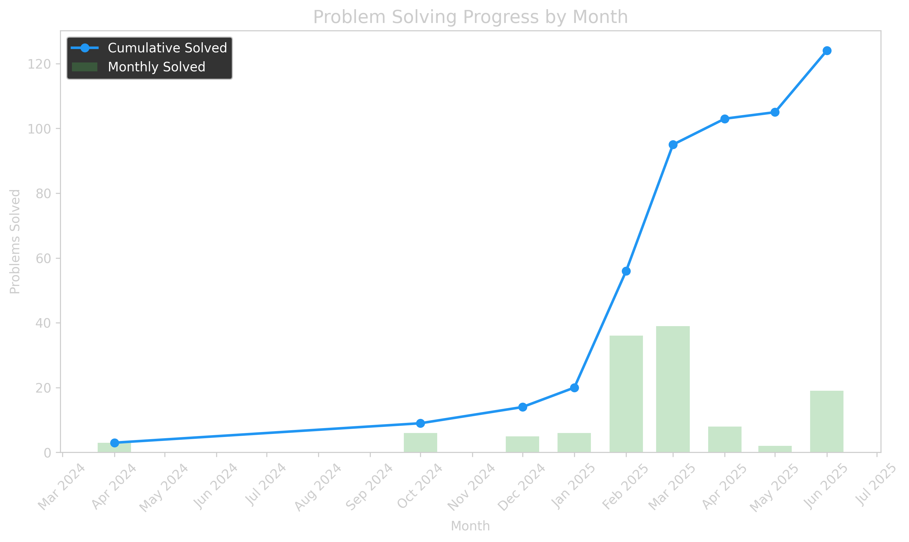

# Job Listings v1 - Faster, More Relevant, and Canonicalized

This project scrapes entry-level and internship job listings from multiple sources, normalizes them into one table, resolves canonical career links when possible, fetches job descriptions for better ranking, and emails a curated list based on your resume and preferences.

## High-level goals

- Relevance: prefer official career pages, and rank by full-text match against your resume and preferences.
- Speed: parallel scraping, cached resolution and description fetching, bounded retries; target <65 minutes/day (60–100 max).
- Organization: one normalized dataset powering analysis and email.

## Daily workflow (GitHub Actions)

```mermaid
flowchart LR
  A[Schedule or Manual Dispatch] --> B[Checkout + Setup Python + Cache deps]
  B --> C[Run orchestrator.py: run all source scripts in parallel]
  C --> D[Analyze: resolve careers, triage, fetch descriptions, Stage2 ranking]
  D --> E[Generate Email + Send]
  D --> F[Write unified outputs (parquet + daily CSVs)]
  E --> G[Commit and push artifacts (if configured)]
```

## Data flow and schema

- Each source emits records normalized to:
  - Company, Position Title, Posted, Description, Careers Page URL, Third Party URL, URL, Source, Match Score, Location, Salary
- URL points to Careers Page URL when available; otherwise falls back to Third Party URL (e.g., LinkedIn).
- Caches:
  - career_page_cache.json: ATS/careers URL by (company, title)
  - job_descriptions_cache.json: URL → cleaned page text
  - job_scores_cache.json: (resume_hash, url) → Stage 2 score

## Matching strategy

- Stage 1: fast triage (title/company heuristics + lexical overlap with your resume).
- Stage 2: accurate ranker (embeddings/LLM) on a small pool; cached.
- Final Match Score combines Stage 1/2 plus ROLE_PREFERENCES weights.

## Limits and budgets

- Actions minutes limit: ~3,000/month → ~60–100 minutes/day budget.
- Enforced via:
  - Workflow timeout-minutes
  - Bounded concurrency (MAX_CONCURRENCY)
  - Strict caps: MAX_LINKEDIN_JOBS, MAX_DESC_PAGES, TOP_K_FOR_LLM
  - Persistent caches to avoid rework

## Setup

1) Secrets (required):
   - RESUME_TEXT: your full resume in plain text (no PDFs).
   - ROLE_PREFERENCES: JSON weights and filters, e.g.:
     {"mlai":1.2,"swe":1.0,"da":0.8,"remote":1.1,"bay_area":1.1,"exclude_levels":["senior","staff","principal","phd"]}

2) Optional envs:
   - MAX_CONCURRENCY=24
   - REQUEST_TIMEOUT=10
   - MAX_LINKEDIN_JOBS=600
   - MAX_DESC_PAGES=800
   - TOP_K_FOR_LLM=400
   - DAYS_OLD=3

3) Local run:
   - python orchestrator.py

## Troubleshooting

- Careers URL missing: some ATS tenants are private/obscure; we fallback to Third Party URL.
- 403/429 errors: retry in subsequent runs; caches limit repeated hits.
- Runtime too long: reduce MAX_LINKEDIN_JOBS, MAX_DESC_PAGES, or TOP_K_FOR_LLM; increase concurrency cautiously.

## Contributing

- Keep scrapers idempotent and source-agnostic; emit normalized records only.
- Respect caps and caches.
- Include unit tests when adding sources or changing heuristics.

---

# LeetCode Progress Dashboard 📊 (Legacy)

## Previous LeetCode Solutions
### get-the-size-of-a-dataframe-3076
- **Runtime:** `589.00ms` (Top 24.98%)
- **Memory:** `65.50MB` (Top 76.23%)

### drop-missing-data-3075
- **Runtime:** `718.00ms` (Top 9.07%)
- **Memory:** `66.20MB` (Top 78.26%)

### select-data-3074
- **Runtime:** `744.00ms` (Top 6.82%)
- **Memory:** `66.20MB` (Top 70.40%)

### reshape-data-melt-3073
- **Runtime:** `408.00ms` (Top 81.04%)
- **Memory:** `65.60MB` (Top 92.47%)

### reshape-data-pivot-3072
- **Runtime:** `406.00ms` (Top 82.17%)
- **Memory:** `66.10MB` (Top 96.26%)

### drop-duplicate-rows-3071
- **Runtime:** `510.00ms` (Top 41.64%)
- **Memory:** `66.60MB` (Top 12.98%)

### fill-missing-data-3070
- **Runtime:** `507.00ms` (Top 42.21%)
- **Memory:** `65.60MB` (Top 67.39%)

### change-data-type-3069
- **Runtime:** `358.00ms` (Top 82.97%)
- **Memory:** `65.50MB` (Top 80.35%)

### rename-columns-3068
- **Runtime:** `388.00ms` (Top 78.63%)
- **Memory:** `65.90MB` (Top 40.02%)

### modify-columns-3067
- **Runtime:** `407.00ms` (Top 72.10%)
- **Memory:** `65.60MB` (Top 66.95%)

## Language Statistics
- **PY**: 90 files
- **JAVA**: 22 files
- **SQL**: 29 files

## Overall Performance
- **Average Runtime:** 191.78ms
- **Average Memory:** 25.20MB

## Visualizations




---

## How to Use: https://github.com/AdityaRao127/leetcode-stats-automation
## Credits
This project uses [LeetCode Sync](https://github.com/marketplace/actions/leetcode-sync) to fetch solutions, runtime, and memory usage data from LeetCode.