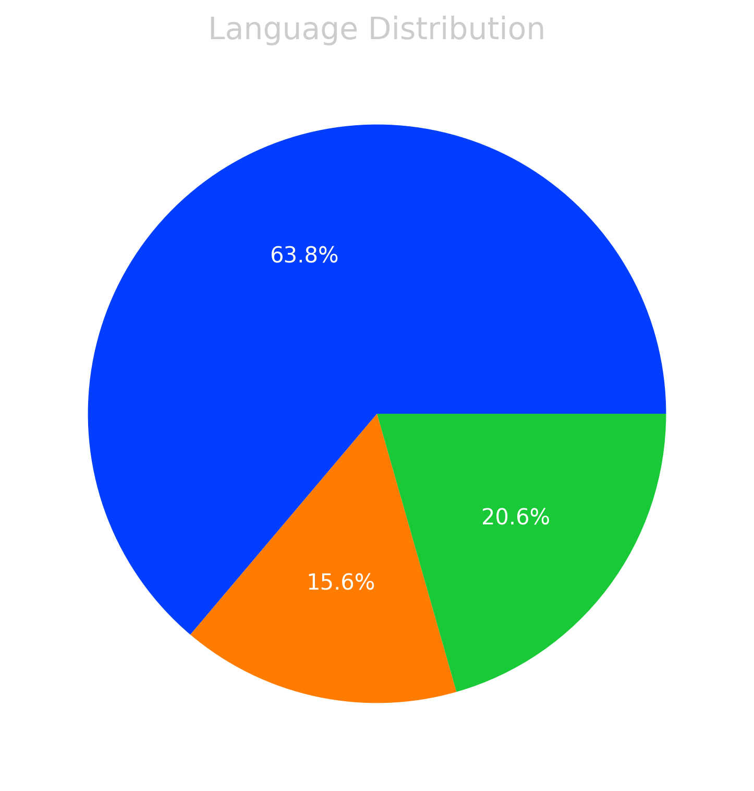
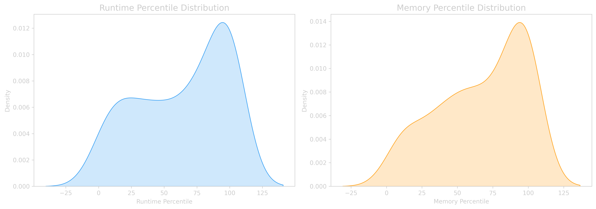

# LeetCode Progress Dashboard 📊

## Recent Solutions
### get-the-size-of-a-dataframe-3076
- **Runtime:** `589.00ms` (Top 24.98%)
- **Memory:** `65.50MB` (Top 76.23%)

### display-the-first-three-rows-3065
- **Runtime:** `684.00ms` (Top 10.24%)
- **Memory:** `65.20MB` (Top 92.86%)

### create-a-dataframe-from-list-3062
- **Runtime:** `573.00ms` (Top 19.90%)
- **Memory:** `64.70MB` (Top 95.87%)

### sum-of-squares-of-special-elements--2844
- **Runtime:** `1.00ms` (Top 100.00%)
- **Memory:** `44.10MB` (Top 95.31%)

### max-sum-of-a-pair-with-equal-sum-of-digits-2473
- **Runtime:** `627.00ms` (Top 7.77%)
- **Memory:** `34.00MB` (Top 14.35%)

### employees-whose-manager-left-the-company-2127
- **Runtime:** `509.00ms` (Top 19.29%)
- **Memory:** `0.00MB` (Top 100.00%)

### recyclable-and-low-fat-products-1908
- **Runtime:** `346.00ms` (Top 82.43%)
- **Memory:** `0.00MB` (Top 100.00%)

### invalid-tweets-1827
- **Runtime:** `787.00ms` (Top 35.64%)
- **Memory:** `0.00MB` (Top 100.00%)

### fix-names-in-a-table-1811
- **Runtime:** `834.00ms` (Top 46.20%)
- **Memory:** `0.00MB` (Top 100.00%)

### patients-with-a-condition-1670
- **Runtime:** `209.00ms` (Top 90.54%)
- **Memory:** `0.00MB` (Top 100.00%)

## Language Statistics
- **PY**: 21 files
- **JAVA**: 11 files
- **SQL**: 10 files

## Overall Performance
- **Average Runtime:** 203.21ms
- **Average Memory:** 22.75MB

## Visualizations

---

## How to Use: https://github.com/AdityaRao127/leetcode-stats-automation
## Credits
This project uses [LeetCode Sync](https://github.com/marketplace/actions/leetcode-sync) to fetch solutions, runtime, and memory usage data from LeetCode.